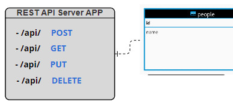
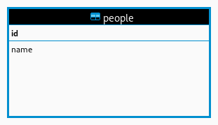

# TASK2-API

## Setup

This API was created using Golang. To setup the API on your local machine, ensure you have installed at least the go version specified in the go.mod file. Clone the repo and run `go mod tidy`.

## Running the API

- Run `go build .`.
- Run `./main`. If the server starts and successfully connects to the database, the string `Fiber ` will be logged in the terminal.

## Usage

Live base url: [https://task02-ann404014.b4a.run/api]

### Create person

This is the endpoint that is used to add a new person to the database.

- #### URL

  /api

- #### Method

  POST

- #### Request Body

  **Required** \
   name=[string]

  Example:

  ```json
  {
    "name": "habeeb"
  }
  ```

- #### Success Response

  Returns the `ID` of the newly created document and the `name`.

  Status Code: `200`

  ```json
  {
    "ID": 1,
    "name": "habeeb"
  }
  ```

### Retrieve person

This is the endpoint that is used to retrieve the document whose `ID` value in the database corresponds to the `userID` URL parameter.

- #### URL

  /api/{userID}

- #### Method

  GET

- #### URL Parameter

  **Required** \
   userID=[int]

- #### Example

  ```url
  /api/1
  ```

- #### Success Response

  Status Code: `200`

  ```json
  {
    "ID": 1,
    "name": "habeeb"
  }
  ```

- #### Error Reponse

  When the provided `userID` does not match any document in the database.

  Status Code: `200`

  ```json
  {
    "error": "No row with found with that id"
  }
  ```

### Edit person

This is the endpoint that is used to change the details of the document whose `ID` corresponds with `userID`.

- #### URL

  /api/{userID}

- #### Method

  PATCH

- #### Request Body

  **Required** \
   name=[string]

- #### Example

  URL

  ```url
  /api/1
  ```

  Body

  ```json
  {
    "name": "lawal"
  }
  ```

- #### Success Response

  Status Code: `200`

  ```json
  {
    "ID": "1",
    "name": "habeeb"
  }
  ```

- #### Error Reponse 1

  When the provided `userID` doesn't match any row in the database.

  Status Code: `200`

  ```json
  {
    "error": "No row with found with that id"
  }
  ```

- #### Error Response 2

  When the body of the request cannot be parsed

  Status Code: `200`

  ```json
  {
    "error": "Failed to parse body"
  }
  ```

- #### Error Response 3

  When the provided `userID` is not a valid integer.

  Status Code: `200`

  ```json
  {
    "error": "Cannot parse the ID from query"
  }
  ```

### Delete person

This is the endpoint that is used to remove the person document with the corresponding userID from the database.

- #### URL

  /api/{userID}

- #### Method

  DELETE

- #### Success Response

  Status Code: `200`

  ```json
  {
    "message": "name of the person with that id"
  }
  ```

- #### Error Reponse 1

  When the provided `userID` is not a valid integer.

  Status Code: `200`

  ```json
  {
    "error": "Cannot parse the ID from query"
  }
  ```

- #### Error Reponse 2

  When the provided `userID` doesn't match any row in the database.

  Status Code: `200`

  ```json
  {
    "error": "No row with found with that id"
  }
  ```
  
[Link to test](main_test.go)

## UML Diagram




## ER Diagram

